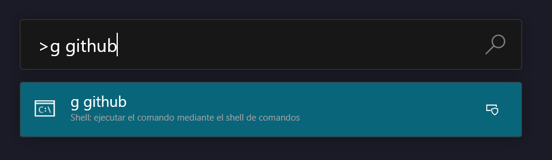
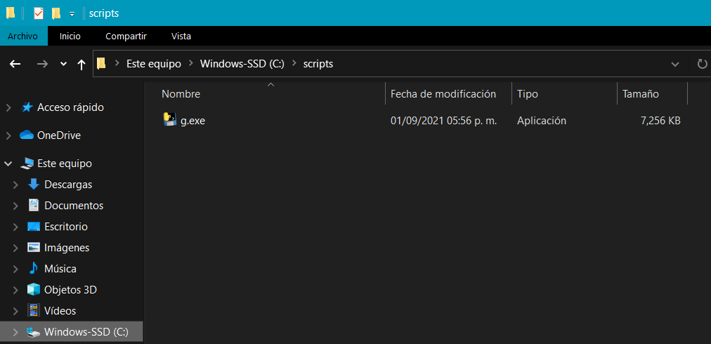
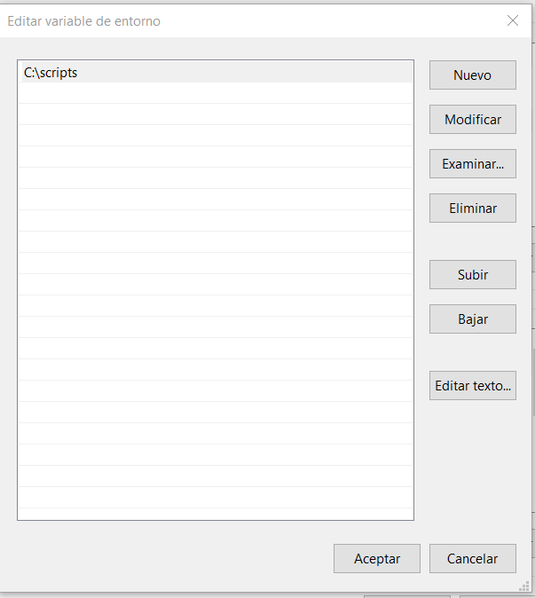
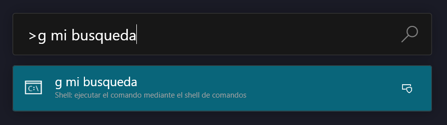
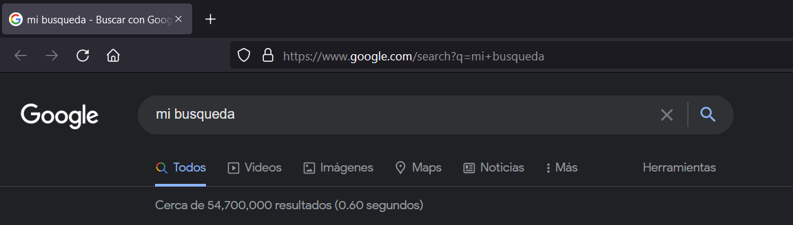

# POWER TOYS RUN Google Searchs

Programa python para añadir a power toys la opción de realizar busquedas web usando Google

## Pasos a seguir

### 1 Clonar el repositorio.

git clone https://github.com/MarcoTorres04/google_search_powertoys.git

### 2 Instalar pyinstaller.

cd google_search_powertoys

pip install -r requirements.txt

### 3 Mover el archivo ejecutable a donde se desee guardar.

### 4 Añadir esa dirección al PATH en las variables de entorno.

### 5 Reiniciar power toys e executar usando '>' al principio

